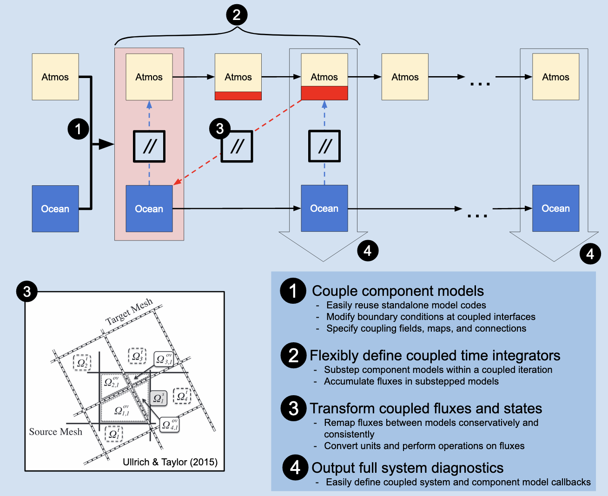

# **Interface**
The interface is designed to fascilitate modular use of model components, which can be run in a coupled or stand-alone mode using the same parent functions. 

*Currently this is awaiting the final cleanup of ClimaSimulations, so we use our own lightweight interface in the meantime.*

# Current prototyping interface
- e.g., implemented using basic sequential coupling in the [sea breeze test case](https://github.com/CliMA/ClimaCoupler.jl/blob/as/agu-seabreeze/experiments/ClimaCore/sea_breeze/run.jl)
- main steps: 
    1. `model1_init`, `model2_init` - initialize ICs, BCs and domains as in the **standalone** versions
    2. `LinearRemap` - define for each direction that remapping is required (e.g. model1>model2, model2>model1)
    3. `cpl_run()`
        - define coupler fields and `parameters`
        - override BCs and ICs of stadalone setups
        - `ODEProblem` per model initializing the `rhs!`
        - `model_integ = init(problem, solver, dt, ...)` per model is initialized
        - sequential loop:
            - pre-model1 ops (e.g., reset flux accumulations, `remap` operators)
            - step!(model1_integ,...)
            - post-model1 ops
            - pre-model2 ops
            - step!(model2_integ,...)
            - post-model2 ops
            - ...
        - return `model_integ`s
- NB: flux calculation and accumulation is done in model1 via the BC specification, customized in the coupler (with the `::CoupledFlux` trait)

# Plan 
- `Simulation(::Coupled, ...)` from ClimaSimulations.jl will replace `cpl_run()` to unify interface with Oceananigans *(beg February)*
    - `solve!(::model, ::callbacks)` from DiffEq.jl, where callbacks interrupt the simulation to perform the coupling, call the diagnostics writer 
    - interface general for designing parallel (concurrent) coupling layouts 
- provide a list of requirements for a model to be able to be coupled with ClimaESM *(March?)*

