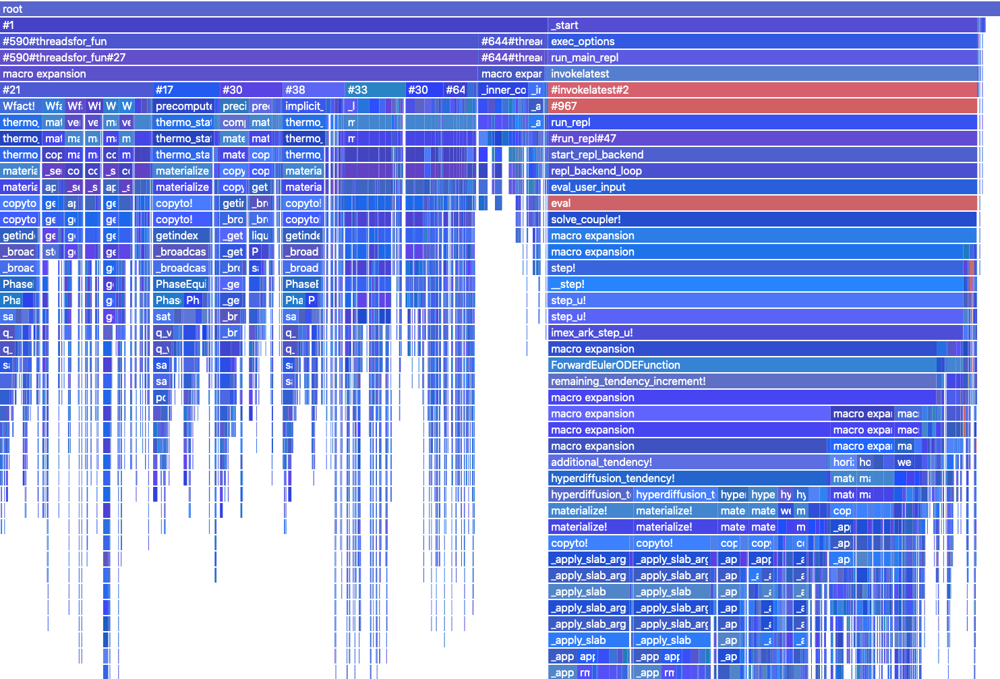

# Performance Analysis Tools

`ClimaCoupler.jl` provides basic tools for analyzing performance:
1. **Flame graphs**: the `perf/flame.jl` script is run by Buildkite to produce flame graphs using [ProfileCanvas.jl](https://github.com/pfitzseb/ProfileCanvas.jl) in the `perf/output/` directory.
2. **Job walltime and allocation history**: use Buildkite to trigger the [`build_history`](https://github.com/CliMA/slurm-buildkite/blob/master/bin/build_history) script to output an interactive plot with the history of memory usage and time elapsed for each tracked job (default: current build and past builds of the `staging` branch over the past year). Use `key` to select which jobs to track. More documentation can be found in the [SLURM-Buildkite Wiki](https://github.com/CliMA/slurm-buildkite/wiki/Memory#plotting-memory-usage-over-time).

## Flame Graph Interpretation
- use for single-process (un)threaded performance CPU profiling of individual stack traces. It provides a tree representation of a set of backtraces, showing the dependence and CPU cost of each function.
- here is an example of a flame graph of ClimaCoupler's AMIP run, produced by Buildkite running the `perf/flame.jl` script:

- each row along the y-axis represents a level of backtraces. In this case the lowermost level is at the top, and the top level represents what is directly being run on the CPU. The stacks in each level are sorted alphabetically (not chronologically, like flame _charts_). The column width is proportional to the presence in samples (related to allocations). The colors are grouped into runtime-dispatch, gc, compilation and default. The intensity is random.
- we also have a local beta version of flame graphs (in `perf/ProfileCanvasDiff.jl` and `perf/ProfileViewerDiff.js`), triggered by the `perf/flame_diff.jl` script, which plots the same flame graphs as above but with the color corresponding to whether the stack allocation has been reduced (blue) or increased (red) compared to the last staged runs. The color intensity is proportional to the fractional change, and black signifies untracked traces. The default is to show the cumulative allocation (current function + all its children functions). By setting `self_count` to `true`, we can also count only the allocations of the current function itself, allowing us to isolate allocation changes within our software from changes in the upstream packages.

## References
- [Description of flame graphs and their interpretation](https://github.com/CliMA/slurm-buildkite/wiki/Flame-Graphs)
- [ClimaCore tips](https://clima.github.io/ClimaCore.jl/dev/performance_tips/) for writing performant code
- [General Julia-specific performance tips](https://docs.julialang.org/en/v1/manual/performance-tips/)
- [Logging performance history using Buildkite and SLURM](https://github.com/CliMA/slurm-buildkite/wiki/Memory)
- [NSight Systems](https://github.com/CliMA/slurm-buildkite/wiki/Nsight-Systems) for MPI profiling using Buildkite and SLURM

